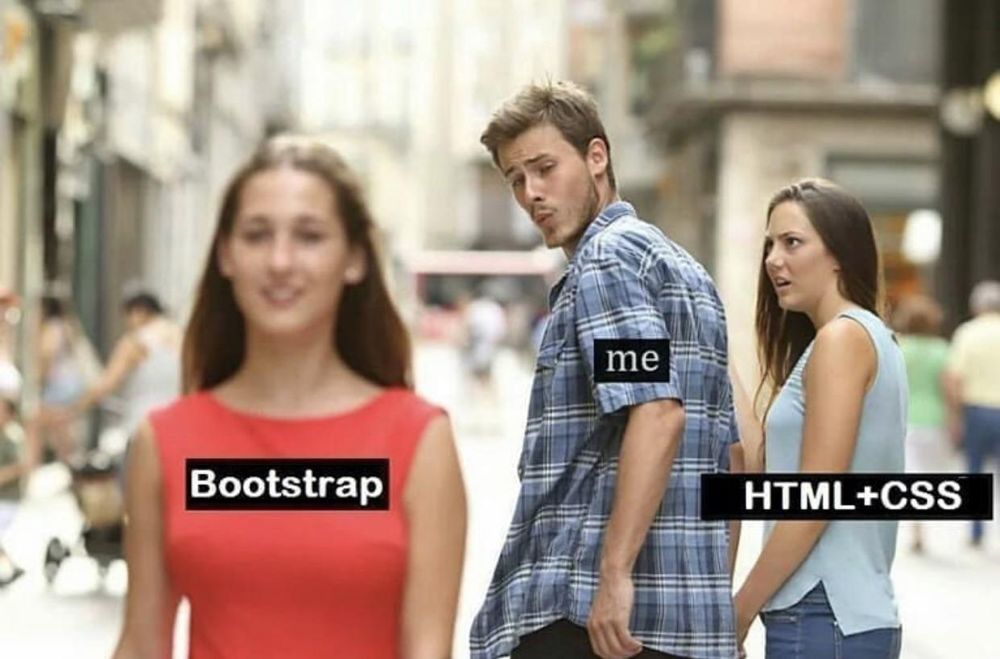

*I believed that HTML and CSS alone were good enough when I first started designing web pages. I could align boxes, add colors, and create buttons. What more could I ask for? It felt like learning a whole new language when I first encountered Bootstrap 5. At first, the sight of rows, columns, containers, and breakpoints was overwhelming. I could just code everything by hand, so why even bother with this?*

## What Does Bootstrap Actually Do for You?

As a user interface (UI) framework, Bootstrap essentially provides developers with pre-made website building blocks, such as buttons, grids, forms, and navigation bars. It's similar to having a design toolkit that is already familiar with responsive design. Responsive design is revolutionary. It implies that everything will automatically adapt to fit your website perfectly, whether someone is viewing it on a laptop, tablet, or phone.

Before Bootstrap, I had to write countless lines of CSS to center an image or ensure that text on mobile devices didn't overflow the screen. With a few classes, Bootstrap resolves that.
---

## The Learning Curve

Naturally, "magic" is not free. At first, learning the Bootstrap grid system (col-6, col-md-4, container-fluid, etc.) was like learning algebra. I had to stop manipulating each pixel by hand. However, everything fell into place when I realized that the framework was handling the challenging tasks for me. Instead of taking hours, I could now create a fully responsive layout in a matter of minutes.

I basically lived on the Bootstrap documentation website in the beginning. I would be looking for ways to align text in a column, center an image, or make a button the proper color every few minutes. With so many classes to learn and rules that didn't always make sense at first, it was like learning another language. I would repeatedly reload my page, make endless adjustments, and copy bits and pieces from the examples until something finally worked. It was slow and occasionally annoying, but the more I used it, the more I got the hang of it.

## Use of AI Assistance

I used ChatGPT (OpenAI’s GPT-5 model) to support the writing of this essay. Specifically, AI helped me with:

- Helping me refine my thoughts and points on the examples, so that my explanations were clearer and more complete.  
- Providing editorial feedback on structure, clarity, and tone.  

The final essay reflects my own understanding and voice, but I acknowledge that AI tools supported me in brainstorming, drafting, and polishing my work.
