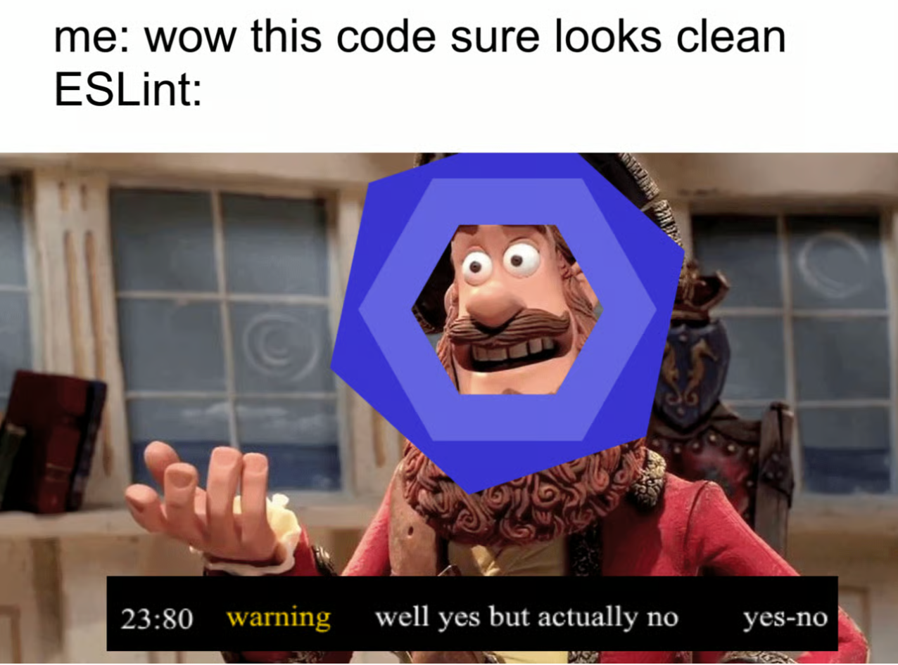

## Getting Past the Small Stuff

People always overlook minor details like where to place curly braces or whether to use two or four spaces for indentation. This is a part of learning the term "coding standards." You may even ask why it even matters if there were two spaces rather than four. What difference does it make? The pointisn't about the importance of spaces, though. Coding standards reduce errors, improve readability, and establish consistency. It's like speaking a common language where everyone follows the same rules. You spend more time comprehending what the code does and less time trying to understand the decisions made by others.

## A Tool That Teaches

One of the most surprising things I found is that coding standards can help you learn programming languages. At first, using ESLint in VSCode was extremely annoying because it picked up a lot of tiny problems. Problems that ChatGPT and Copilot wouldn't catch. I would find myself saying, "Really?" I have to change all of these double quotes to singles? But eventually, I realized it was really helping me form better habits. Just fixing the warnings taught me about safe equality checks, unused variables, and clear naming.

## Painful but Useful

I'll be honest... at first, it took a lot of time to fix all the ESLint errors. I felt like I was fighting ES Lint because of how much it slowed me down. However, I sometimes have to remind myself, "If it's screaming at me, maybe there's a reason." Right now, I am still very frustrated with it, but I hope that my appreciation for it grows as I work with it more. I do find that my code gets cleaner and simpler to read as because of those "annoying" warnings.

## My Takeaway

At first glance, coding standards may appear strict or redundant or unnecessary, or useless, but I can tell that they will have long-term advantages. They push you to write better code and teach you best practices for the language along the way. They will still annoy me a lot, but I know this will help me grow.

## Use of AI Assistance

I used ChatGPT (OpenAI’s GPT-5 model) to support the writing of this essay. Specifically, AI helped me with:

Helping me refine my thoughts and points on the examples, so that my explanations were clearer and more complete.
Providing editorial feedback on structure, clarity, and tone.
The final essay reflects my own understanding and voice, but I acknowledge that AI tools supported me in brainstorming, drafting, and polishing my work.
