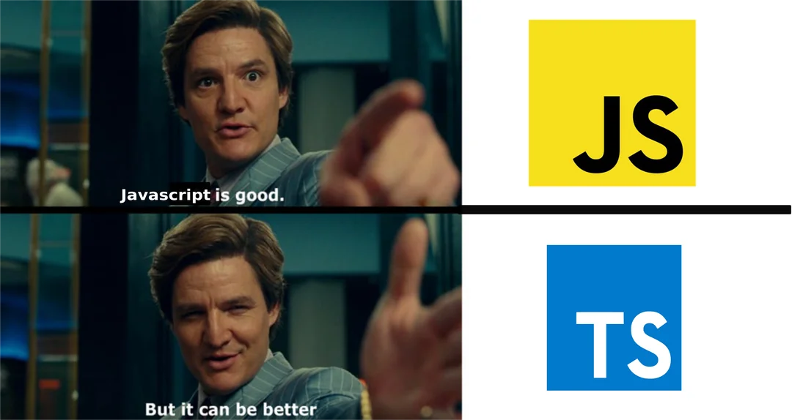

*I wrote this essay for my University of Hawaiʻi at Mānoa ICS 314 class. In addition to helping me reflect on what I've learned, this assignment aims to write in a way that might be helpful to someone outside of the classroom—possibly even an employer who wants to know how I approach new resources and learning environments.*

## Adjusting to a New Language

I had previously been coding mostly in Java before taking ICS 314. I also had some experience with C++ and Python. However, TypeScript seemed to be operating under its own set of guidelines. It looks a lot like JavaScript on the surface, but it seems to have guardrails or training wheels. In contrast to JavaScript's "try it and see if it breaks" mentality, the type system is there to identify errors before they become bugs.

TypeScript is more flexible and less strict than Java, which is sometimes refreshing but also... weird. I learned to expect that every little detail would matter (and occasionally blow up if I wasn't careful) in C++, so TypeScript's balance of structure and flexibility feels like a compromise. I can see how TypeScript scales better when working on larger projects, but Python still feels "friendlier" with its simpler syntax.

## What I Actually Learned

I had some experience with web editing and GitHub before this module, but I had never created a professional-style portfolio from the ground up. My greatest takeaway from this project was not so much syntax, since it was the experience of creating an online persona. Additionally, I found myself learning more about CSS than I had ever done before, and how minor design decisions can drastically alter how "professional" or "unfinished" a website feels.

Another surprising lesson was learning how to incorporate AI into the process. I used it as a second set of eyes on my code, to clarify HTML features, and when I was stuck on CSS details. Effectively prompting AI is becoming crucial, and this course provided me with many chances to hone in on that ability.

## TypeScript Through a Software Engineer’s Eyes

If I were a software engineer assessing TypeScript instead of a student, I would say that it's a good language for projects that require both teamwork and long-term maintainability. Though it doesn't restrict you as much as Java might, the typing system does enforce discipline. 

Would I want to construct all of my projects using it? Probably not. However, TypeScript seems to be a good option for web applications.

## The WODs: Stressful but Useful

I first learned about WODs (Workouts of the Day) in my ICS 314 class. They are essentially timed coding challenges designed to mimic real-world problem-solving. They initially felt intense and, to be honest, stressful. Although the videos that go with the practice WODs are out of date, I still found them to be beneficial.

I believe that adding AI guidance would elevate WODs to a new level. Learning how to use tools like ChatGPT could be just as beneficial as practicing syntax. Professionals in the real world are using AI more and more in their workflow, so having students practice that skill in class would reflect industry reality.

## My Style of Learning

The WODs revealed the truth about how I learn-- I require a balanced mix of direction and pressure. It doesn't feel good to put me through a timed test without providing enough updated walkthroughs, but it was really beneficial to combine that stress with a big project early in the semester (this portfolio). 

Do I like this type of learning? I wouldn't say "enjoy" isn't the right word but it's more like training. It's challenging and occasionally annoying, but in the end, it strengthens resilience.

## Writing With AI

One interesting twist to this essay is that I didn’t write it alone—I collaborated with AI. I made sure the style matched to technical writing criteria by using AI to help me refine and professionalize my ideas. I view this as learning how to prompt, refine, and edit using a tool that reflects what many industry professionals already do. This experience also ties into another essay I'm writing about AI and homework, where I address the line between using AI as a learning aid and as a shortcut. With AI's help, I was able to write this article and gain firsthand knowledge of how that balance can be implemented.

## Closing Thoughts

Although it hasn't been easy, learning TypeScript while juggling WODs and projects has really opened my eyes. I have personally witnessed how a project can enhance my professional image, how a language can alter my perspective on software engineering, and how stress can develop real skills.

In the end, TypeScript may not be my favorite language, but I can see its benefits and how the unique approach of this course will help me become a better problem solver as well as a better coder.
