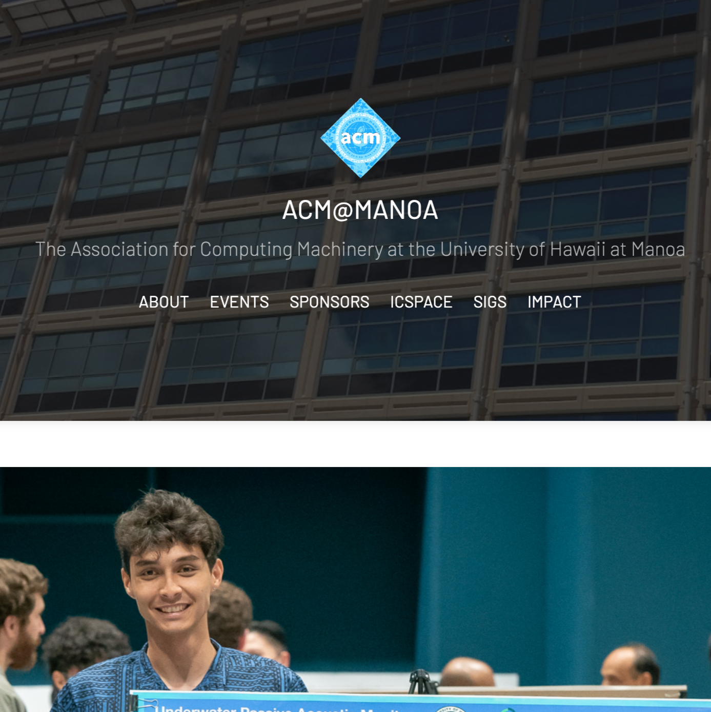

Alongside the Association for Computing Machinery (ACM) Software Development Team, I contributed to the maintenance and enhancement of the club’s official website, which serves as the primary hub for student information, events, and resources. The site needed to stay current and user-friendly so members could easily access schedules, opportunities, and updates.

Working in a small team, I helped improve the site’s design and functionality using React while ensuring content updates were accurate and timely. Our collaboration included reviewing code, troubleshooting bugs, and deploying changes in a way that minimized downtime and disruption for users.

This project also strengthened my technical foundation in Git and command line workflows, as I frequently pushed, pulled, and merged changes to keep the site aligned with team updates. By contributing to the website, I not only improved my technical and collaboration skills but also supported a vital tool that directly enhances ACM’s visibility and member engagement.

Source: <a href="https://acmmanoa.org/"><i class="large github icon "></i>https://acmmanoa.org/</a>
