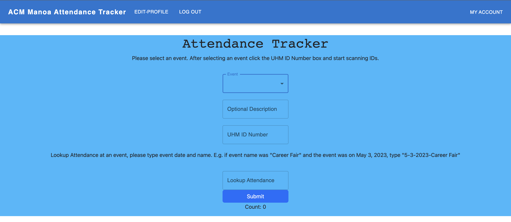

As part of the Association for Computing Machinery (ACM) Software Development Team, I collaborated with a small group of developers to create a custom attendance tracking system used across the club’s seven Special Interest Groups (SIGs). Tracking attendance was essential for securing funding and demonstrating member engagement, but existing solutions like ID scanners weren’t feasible due to limited hardware availability.

To address this, we designed and developed a React-based web application that allowed ACM to record attendance in an efficient and reliable way without the need for specialized scanners. The project required careful planning around usability, scalability, and data accuracy to meet the needs of both students and club officers.

Through this project, I gained hands-on experience with Git and the command line to push, pull, and manage project updates, while collaborating in a team environment that emphasized version control, peer feedback, and iterative development. The experience strengthened my technical skills and gave me insight into building practical software solutions that directly support organizational needs.

Source: <a href="https://attendance.acmmanoa.org/login"><i class="large github icon "></i>https://attendance.acmmanoa.org/login</a>
