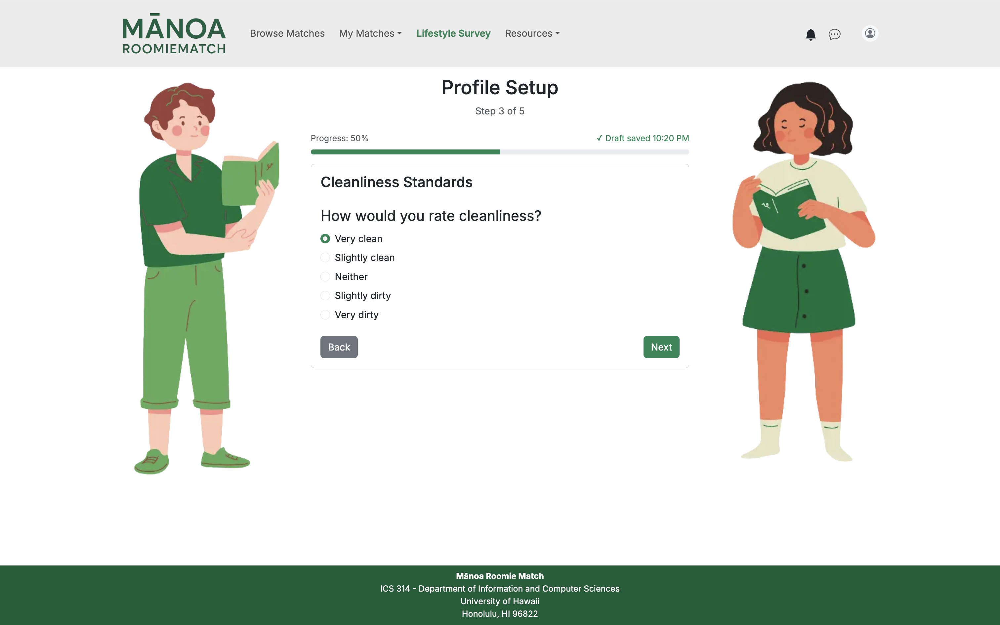

Mānoa RoomieMatch is a web application that provides UH students with a personalized, AI-enhanced roommate matching experience. Students log in and create a lifestyle profile covering sleep routines, cleanliness standards, study habits, noise tolerance, guest expectations, cooking frequency, personality traits, and budget/space preferences. The system compares profiles to generate a compatibility score, along with an AI-generated explanation describing areas of alignment and potential conflict. Students can browse matches, view detailed comparisons, and reach out to peers they're compatible with. In addition, the system can generate AI-assisted communication templates, personalized housing advice, and conflict-prevention tips based on the student's preferences.

Every semester, hundreds of UH Mānoa students struggle to find compatible roommates—whether in the dorms (Hale Aloha, Gateway, Frear) or in off-campus apartments. This issue is amplified by the fact that approximately 31% to 36% of the UH Mānoa student population comes from out of state, meaning a large portion of students arrive in Hawaiʻi without established local connections or housing arrangements. Students commonly report conflicts due to mismatched sleep schedules, noise preferences, cleanliness expectations, guest habits, or study routines. Without a structured way to evaluate compatibility, students rely on random Snapchat posts, word-of-mouth searching, or even dating apps, often resulting in stressful living situations, roommate conflicts, and frequent room switches.

As part of a collaborative team of six students, I contributed to designing, implementing, and maintaining this full-stack application. The project illustrates various technologies useful to ICS software engineering students, including HTML and CSS for structuring web content and styling pages, Next.js for server-side rendering and routing in React applications, React for component-based UI implementation and efficient client-side rendering, and React Bootstrap for responsive UI design. Through this project, I gained hands-on experience with modern web development frameworks, database design with PostgreSQL, AI integration, and collaborative development using Git and GitHub in an agile team environment.

Website Link: <a href="https://manoaroomiematch.github.io/"><i class="large github icon "></i>https://manoaroomiematch.github.io/</a>
